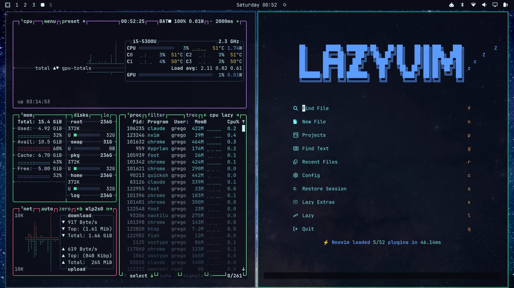

# Hackerboy — an Omarchy theme

[Omarchy](https://omarchy.org/)'s stock **Hackerman** theme — near-black
navy background, neon-green accent — with a **full-colour terminal
palette**. Hackerman maps every ANSI colour to a shade of green, so
`eza`/`ls`, `git diff` and syntax highlighting come out green-on-green.
Hackerboy keeps the look and gives red, yellow, orange, blue, magenta
and brown real hues, so colour separates meaning again.



- `background = #0B0C16`, `foreground = #ddf7ff`, `accent = #82FB9C`
  (all unchanged from Hackerman, as are green and cyan)
- New hues: `red #ff5f7a`, `yellow #f7d450`, `orange #ffa057`,
  `blue #5c9dff`, `magenta #c77dff`, `brown #b08d57` (plus brights)
- Folder icons: same as Hackerman
- 4 bundled backgrounds in `backgrounds/`

Window borders and the bar stay Hackerman green. Anything Omarchy
generates from the palette — btop, Neovim, VS Code, error colours —
picks up the new hues.

## Install

```bash
omarchy theme install https://github.com/ggregoro/hackerboy
omarchy theme set Hackerboy
```

Or clone it manually:

```bash
git clone https://github.com/ggregoro/hackerboy \
  ~/.config/omarchy/themes/hackerboy
omarchy theme set hackerboy
```

Cycle backgrounds with `Super+Ctrl+Space` or `omarchy theme bg next`.

## Tweaking

Edit `colors.toml`, then re-run `omarchy theme set hackerboy`.
Everything else — terminal colours, Hyprland borders, the bar, btop,
Neovim — regenerates from it.

## Revert

`omarchy theme set hackerman` returns to Omarchy's stock theme.

## Credits & licensing

The base palette (background, foreground, accent, green, cyan) comes
from the Hackerman theme that ships with Omarchy. The bundled wallpapers
are a personal selection, including a Milky Way photo by Jeremy Thomas
on Unsplash. Swap `backgrounds/` for your own if you prefer. Theme files
(`colors.toml`, `icons.theme`, this README) are MIT-licensed — see
`LICENSE`.
